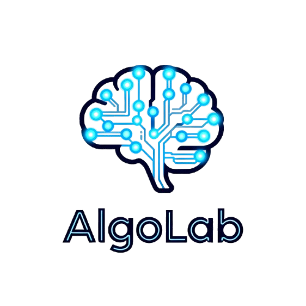
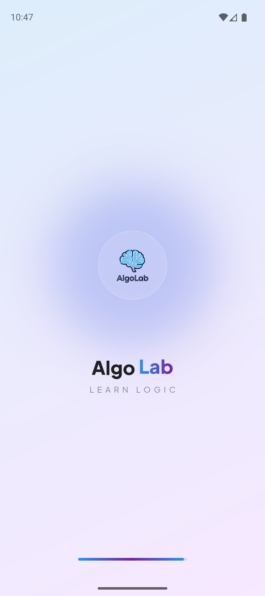
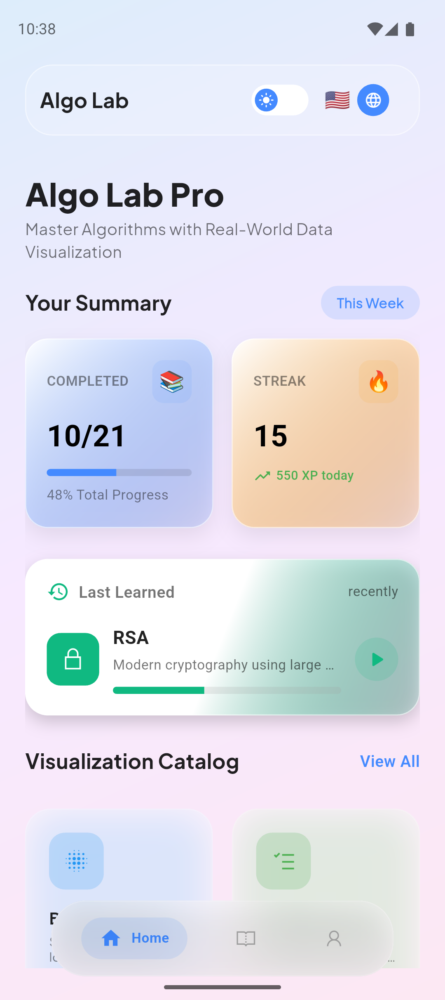
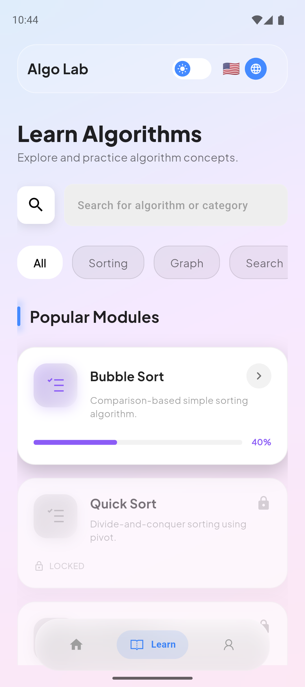
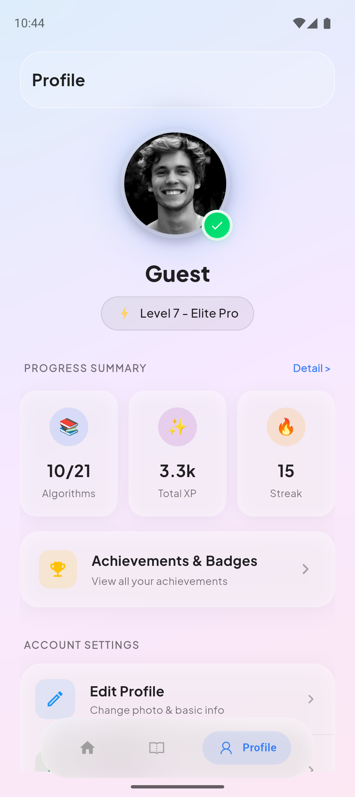
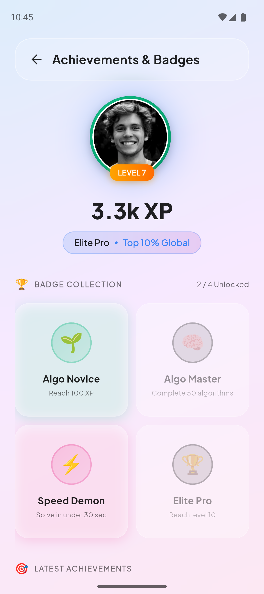

#  Algo Lab

[](https://flutter.dev)
[](https://dart.dev)
[](https://firebase.google.com)
[](https://blog.cleancoder.com/uncle-bob/2012/08/13/the-clean-architecture.html)

**Algo Lab** is a state-of-the-art educational platform designed to bridge the gap between abstract algorithmic concepts and real-world application. Built with a stunning **Glassmorphism UI**, it provides an immersive learning experience through interactive visualizations and structured modules.

---

## 🌟 Vision
Mastering algorithms shouldn't be boring. Algo Lab transforms complex logic into beautiful, interactive stories—from sorting massive data shards to optimizing autonomous drone routes.

---

## ✨ Key Features

### 🎨 Premium Visualizers
Each algorithm is visualized through a themed "Case Study" to provide immediate context:
*   **Logistics Optimization (A* Pathfinding)**: Navigate complex terrains with weights (traffic) and obstacles.
*   **E-Banking Security (RSA Encryption)**: Visualize asymmetric key generation and the movement of encrypted data blocks.
*   **System Performance (Sorting Algorithms)**: Experience Bubble, Selection, Insertion, and Quick Sort with fluid animations.

### 📚 Immersive Learning Modules
*   **Cloud-Synced Progress**: Your achievements and levels are safely stored in Firestore.
*   **Integrated IDE**: A VS Code-inspired code editor for practicing algorithm implementation.
*   **Smart Quizzes**: Test your retention with interactive challenges.
*   **Dual Language**: Seamlessly switch between **English** and **Indonesian**.

### 🏆 Gamified Experience
*   **XP & Leveling**: Gain experience points for every lab completed.
*   **Achievement Gallery**: Showcase your mastery with unique badges.
*   **Streak System**: Stay motivated with daily learning targets.

---

## 📸 App Preview

| Welcome | Digital Catalog | Immersive Learning |
| :---: | :---: | :---: |
|  |  |  |

| RSA Lab Visualization | User Profile | Achievements |
| :---: | :---: | :---: |
|  |  |  |

---

## 🏗 Project Architecture
The project follows **Clean Architecture** principles to ensure scalability and testability:

```text
lib/
├── core/               # Theme, DI, Constants, Router, Services
├── features/
│   ├── home/           # Catalog & Main Navigation
│   ├── learning/       # Documentation, Editor, Quizzes
│   ├── pathfinding/    # A* Logic & Visualizer
│   ├── cryptography_lab/# RSA Logic & Visualizer
│   ├── sorting_lab/     # Sorting Algorithms & Visualizers
│   ├── profile/        # Progress, Achievements, Settings
│   └── splash/         # Entry logic
```

---

## 🚀 Getting Started

### Prerequisites
- Flutter SDK (Latest Stable)
- Firebase Account
- Android Studio / VS Code

### Installation
1.  **Clone & Fetch**
    ```bash
    git clone https://github.com/vikry28/algo_lab.git
    cd algo_lab
    flutter pub get
    ```
2.  **Firebase Configuration**
    - Place `google-services.json` in `android/app/`
    - Place `GoogleService-Info.plist` in `ios/Runner/`
3.  **Run with Style**
    ```bash
    flutter run
    ```

---

## 🧪 Quality Assurance
We take logic seriously. The core algorithm engines are protected by unit tests:
```bash
flutter test
```
*Current coverage includes A* Pathfinding logic, RSA encryption consistency, and Sorting step generation.*

---

## 🤝 Contributing
Contributions are welcome! If you have a visualization idea or an algorithm to add:
1. Fork the Project
2. Create your Feature Branch (`git checkout -b feature/AmazingFeature`)
3. Commit your Changes (`git commit -m 'Add some AmazingFeature'`)
4. Push to the Branch (`git push origin feature/AmazingFeature`)
5. Open a Pull Request

---